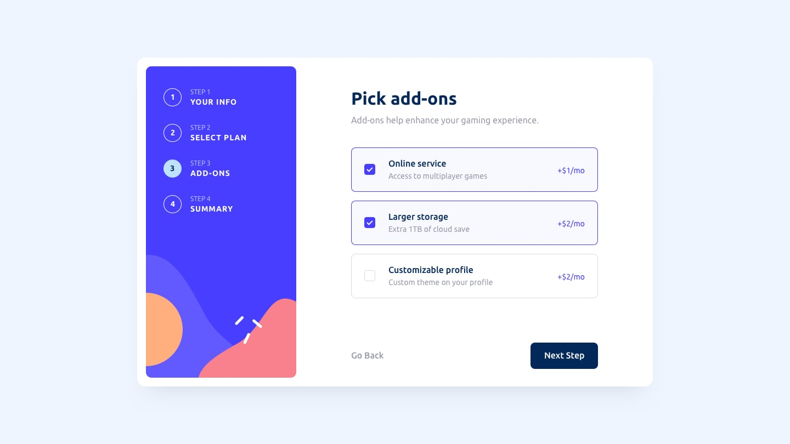
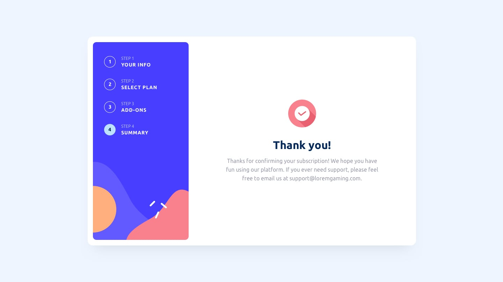

# Multi-step form solution

This is a solution to the [Multi-step form challenge on Frontend Mentor](https://www.frontendmentor.io/challenges/multistep-form-YVAnSdqQBJ). Frontend Mentor challenges help you improve your coding skills by building realistic projects. 

## Table of contents

- [Overview](#overview)
  - [The challenge](#the-challenge)
  - [Screenshot](#screenshot)
  - [Links](#links)
  - [Built with](#built-with)
- [Author](#author)

## Overview

### The challenge

Users should be able to:

- Complete each step of the sequence
- Go back to a previous step to update their selections
- See a summary of their selections on the final step and confirm their order
- View the optimal layout for the interface depending on their device's screen size
- See hover and focus states for all interactive elements on the page
- Receive form validation messages if:
  - A field has been missed
  - The email address is not formatted correctly
  - A step is submitted, but no selection has been made

### Screenshot

### Links

- Solution URL: [solution](https://your-solution-url.com)
- Live Site URL: [site](https://your-live-site-url.com)

### Built with

- Semantic HTML5 markup
- SCSS
- Flexbox
- Mobile-first workflow
- [React](https://reactjs.org/) - JS library
- Bootstrap
- Formik
- Yup

## Author

- Frontend Mentor - [@Maxim-Pv](https://www.frontendmentor.io/profile/Maxim-Pv)
- Linked in - [@Maxim_Pavlov](https://www.linkedin.com/in/maksim-pavlov-12b22528b/?locale=en_US)

